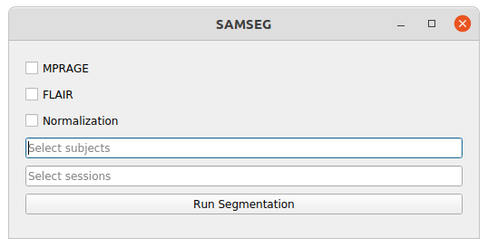
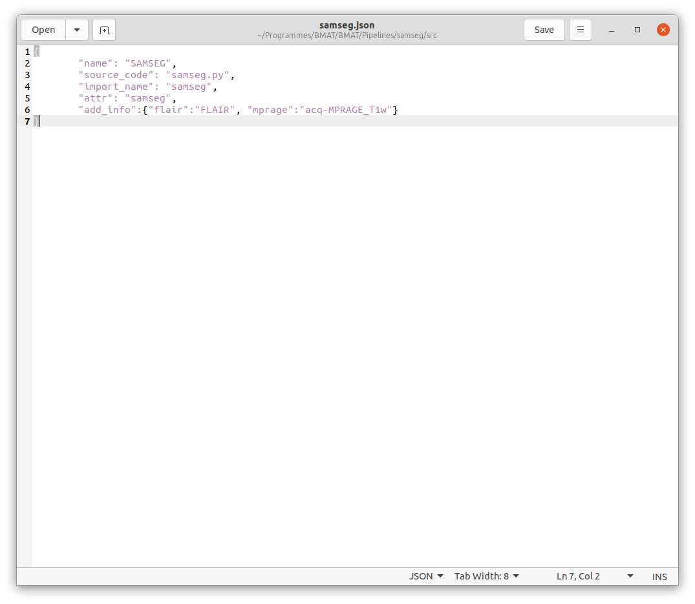

# samseg
Brain White Matter Lesion segmentation pipeline using SAMSEG

## Requirements

**This pipeline required FreeSurfer to already be installed on the user's computer**. Another version of this pipeline uses FreeSurfer in a docker and can be found to this link: [samseg-docker](https://github.com/BMAT-Apps/samseg-docker). This pipeline provides the possibility to perform an automatic segmentation of white matter lesions using SAMSEG from FreeSurfer ([SAMSEG](https://surfer.nmr.mgh.harvard.edu/fswiki/Samseg)).

## Utilization

The first figure below shows the window of this pipeline. This window contains the following information:

* "MPRAGE" checkbox: used to indicate to the pipeline to use a MPRAGE image for the segmentation

* "FLAIR" checkbox: used to indicate to the pipeline to use a FLAIR image for the segmentation

* "Normalization" checkbox: used to indicate to the pipeline to preprocess the images with a normalization step.

* "Select subjects" input: allows the user to script the automatic segmentation for subjects of the dataset by adding a list BIDS ID (without "sub-") separated by a comma. Possible values are: single BIDS ID (e.g. "001,002,006,013"), multiple folowing BIDS ID (e.g. "001-005" is the same as '001,002,003,004,005"), or all subjects ("all").

* "Select sessions" input: allows the user to script the automatic segmentation for sessions of subjects of the dataset by adding a list session ID (without "ses-") separated by a comma. Possible values are: single session ID (e.g. "01,02,06,13"), multiple folowing session ID (e.g. "01-05" is the same as '01,02,03,04,05"), or all sessions ("all").

* "Run Segmentation" button: launch the automatic segmentaion based on all information given by the user

*Typically, a segmentation takes about 20 minutes*

The user needs to specify the name of the MPRAGE sequence and the FLAIR sequence used in this dataset via the "add_info" dictionnary in the json file of the pipeline (cf. figure below). By default, the FLAIR sequence is "FLAIR" and MPRAGE is "acq-MPRAGE_T1w".

